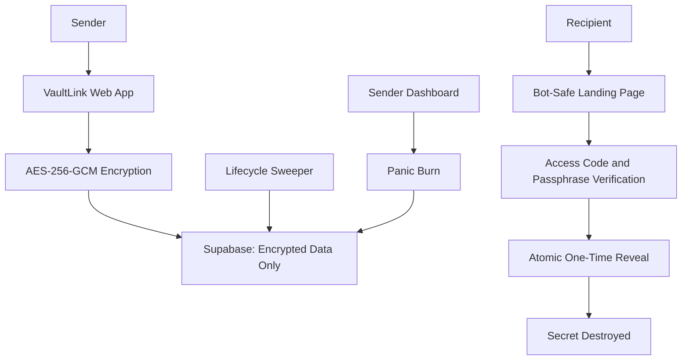

# VaultLink: Secure Handover Room

> A production-grade, zero-knowledge, self-destructing secret sharing platform built with Node.js, Express, AES-256-GCM authenticated encryption, and Supabase PostgreSQL.

---

## 📖 Project Overview

**VaultLink** is an enterprise-grade secure handover platform engineered to share highly confidential credentials—API tokens, private keys, database passwords, and environment files—without leaving traces in intermediate databases, chat history, or server logs. 

VaultLink couples **authenticated symmetric encryption (AES-256-GCM)** with **atomic database-level serialization**, **bot-safe link preview filtering**, **dual-factor verification (6-digit PIN + passphrase)**, **scheduled delivery**, **panic revocation**, and **anonymous receipt acknowledgement**.

---

## ⚠️ Problem Statement

Modern development and operations teams regularly need to exchange sensitive credentials. However, conventional transmission channels introduce severe security risks:

1. **Persistent Chat & Email Trails:** Pasting API keys or passwords into Slack, Microsoft Teams, WhatsApp, or email leaves plaintext credentials stored in searchable third-party server databases and local desktop caches indefinitely.
2. **Link-Preview Scraper Burn:** Modern chat applications automatically crawl posted links to fetch preview metadata. On naive one-time secret platforms, the crawler's HTTP `GET` request immediately destroys the secret before the intended human recipient ever opens the URL.
3. **Concurrency Race Conditions:** In naive database models (`SELECT` view count, check if > 0, `UPDATE` decrement), 20 simultaneous requests can exploit race conditions to read the secret 20 times before any decrement completes.
4. **Cloud Database Breach Exposure:** If a cloud database is compromised or backed up insecurely, stored credentials stored without authenticated encryption or with reversible encoding (like Base64) are compromised in bulk.

VaultLink eliminates these risks through a defense-in-depth, zero-knowledge architecture.

---

## ✨ Features

- 🔐 **Authenticated AES-256-GCM Encryption:** 256-bit symmetric encryption with a fresh 12-byte initialization vector (IV) per secret and a 16-byte authentication tag ensuring ciphertext integrity.
- 🛡️ **Zero-Knowledge Cloud Persistence:** Supabase stores only authenticated ciphertexts, salted bcrypt hashes, and safe metadata. Plaintext secrets, access codes, passphrases, and raw tokens never touch persistent storage.
- 🤖 **Bot-Safe Link Preview Shield:** Link-preview crawlers (Slackbot, Discordbot, WhatsApp, Twitter, etc.) are intercepted at the HTTP boundary and served a harmless preview notice without querying the database or consuming views.
- 🔑 **Dual-Factor Access Control:** Recipient must supply both a 6-digit access code (shared via an out-of-band channel) and a passphrase. Salted bcrypt hashing and brute-force rate limits (max 5 failed attempts/10 min) prevent guessing.
- ⚡ **Atomic PostgreSQL Serialization:** Stored procedures acquire pessimistic `FOR UPDATE` row locks, guaranteeing that a 1-view secret queried by 20 simultaneous parallel requests yields **exactly 1 success (HTTP 200)** and **19 blocked requests (HTTP 404)**.
- ⏰ **Scheduled Availability & Automated Lifecycle Sweeper:** Handover release can be scheduled for a future timestamp (`available_at`). A 15-second background daemon automatically transitions scheduled secrets to active and shreds expired ciphertexts.
- 💣 **Sender Management Dashboard & Panic Burn:** Senders receive a private management link with an ephemeral HMAC-SHA256 session cookie (`HttpOnly`, `SameSite=Strict`) to monitor safe delivery telemetry in real time and trigger emergency revocation.
- 📬 **Privacy-Preserving Receipt Acknowledgement:** Recipients can confirm receipt without revealing their identity, IP, or browser fingerprint. Dashboard displays confirmation timestamp.
- 🎪 **Presentation Demo Mode:** Air-gapped from production, offering a 1-click live demonstration of crawler shielding, multi-factor verification, and 20-request parallel concurrency tests.
- 🛡️ **Security Hardened Middleware:** Helmet security headers, strict anti-caching (`no-store`), express-rate-limit protection, and sanitized logging.

---

## 🏛️ Architecture



---

## 💻 Tech Stack

- **Runtime & Backend:** Node.js (v20+), Express.js
- **Persistence & Stored Procedures:** PostgreSQL 15+ hosted on Supabase (with Row Level Security enabled)
- **Cryptography:** Node.js native `crypto` module (`aes-256-gcm`, CSPRNG `randomBytes`, SHA-256)
- **Hashing & Authentication:** `bcrypt` (adaptive salt rounds), HMAC-SHA256 session signing
- **Security Middleware:** `helmet` (CSP, frameguard, nosniff), `express-rate-limit`, cookie-parser
- **Testing Engine:** Node.js built-in test runner (`node --test`)
- **Frontend:** Vanilla HTML5, CSS3 (responsive dark security theme), vanilla JavaScript (no frontend build step required), QR code generator

---

## 🗄️ Supabase Setup

1. **Create Supabase Project:**
   - Log into [Supabase](https://supabase.com) and click **New Project**.
   - Set a name (e.g. `vaultlink`), database password, and region.
2. **Execute Database Schema:**
   - Open the **SQL Editor** tab in your Supabase dashboard.
   - Paste the complete contents of [`supabase-schema.sql`](supabase-schema.sql).
   - Click **Run** to execute the script.
   - This creates `secrets`, `verification_tokens`, `acknowledgement_tokens`, and `secret_events` tables, along with all security definer stored procedures (`reveal_secret_atomically`, `panic_burn_secret_atomically`, `acknowledge_secret_atomically`, `maintain_secret_lifecycle`).
3. **Verify Row Level Security (RLS):**
   - Confirm in the **Table Editor** that RLS is enabled on all tables.
4. **Retrieve API Credentials:**
   - Go to **Project Settings** > **API**.
   - Copy **Project URL** and the server-only `service_role` secret key.

---

## ⚙️ Environment Variables

Create a `.env` file in the project root based on `.env.example`:

```env
# Application Server
PORT=3000
APP_BASE_URL=http://localhost:3000
NODE_ENV=development

# Supabase Credentials (Service Role Key strictly for backend)
SUPABASE_URL=https://your-project.supabase.co
SUPABASE_SECRET_KEY=your-supabase-service-role-secret-key

# Cryptography (32-byte Base64-encoded master key)
VAULT_MASTER_KEY=your-32-byte-base64-master-encryption-key
BCRYPT_SALT_ROUNDS=10

# Session Management
MANAGEMENT_SESSION_SECRET=your-random-hmac-signing-secret

# Presentation Demo Mode (false in production)
DEMO_MODE_ENABLED=true
```

To generate a secure 32-byte base64 master key:
```bash
node -e "console.log(require('crypto').randomBytes(32).toString('base64'))"
```

---

## 🚀 Installation and Run Commands

1. **Clone repository and install dependencies:**
   ```bash
   git clone <repo-url>
   cd vaultlink
   npm install
   ```
2. **Configure environment:**
   ```bash
   cp .env.example .env
   # Edit .env with your Supabase credentials and master key
   ```
3. **Start the application:**
   - **Production Mode:**
     ```bash
     npm start
     ```
   - **Development Mode (with auto-reload):**
     ```bash
     npm run dev
     ```
4. **Access web app:**
   Open [http://localhost:3000](http://localhost:3000) in your browser.

---

## 📡 API Documentation

### Sensitive Route Headers
All sensitive routes automatically return the following security headers:
```http
Cache-Control: no-store, no-cache, must-revalidate, private
Pragma: no-cache
X-Robots-Tag: noindex, nofollow, noarchive
Referrer-Policy: no-referrer
X-Frame-Options: DENY
X-Content-Type-Options: nosniff
```

### Rate Limiting Rules
- **General API (`/api/*`):** 100 requests per IP per 15 minutes.
- **Create Secret (`POST /api/secrets`):** 10 requests per IP per hour.
- **Verify Secret (`POST /api/secrets/:id/verify`):** Maximum 5 failed attempts per IP + secret ID per 10 minutes.
- **Reveal Secret (`POST /api/secrets/:id/reveal`):** 10 requests per IP per 10 minutes.
- **Panic Burn (`POST /api/secrets/:id/panic-burn`):** 10 requests per IP per 15 minutes.

---

### Endpoint Reference

#### 1. `POST /api/secrets`
Creates an encrypted secret handover room.
- **Body:**
  ```json
  {
    "secret": "my-database-password-xyz",
    "ttl_seconds": 3600,
    "max_views": 1,
    "passphrase": "CorrectHorseBatteryStaple!2026",
    "access_code": "849201",
    "available_at": "2026-09-24T19:00:00.000Z"
  }
  ```
- **Response (`201 Created`):**
  ```json
  {
    "id": "2Qi2cXS-9o1BKRcGigdl8",
    "view_url": "http://localhost:3000/view/2Qi2cXS-9o1BKRcGigdl8",
    "manage_url": "http://localhost:3000/manage/2Qi2cXS-9o1BKRcGigdl8?token=...",
    "expires_at": "2026-09-24T20:00:00.000Z",
    "available_at": "2026-09-24T19:00:00.000Z",
    "views_remaining": 1,
    "status": "scheduled",
    "secret_fingerprint": "a3f5b9c1d0e2"
  }
  ```

#### 2. `POST /api/secrets/:id/verify`
Authenticates 6-digit access code and passphrase. Issues a single-use 120-second verification token.
- **Body:**
  ```json
  {
    "access_code": "849201",
    "passphrase": "CorrectHorseBatteryStaple!2026"
  }
  ```
- **Response (`200 OK`):**
  ```json
  {
    "verified": true,
    "verification_token": "j8X9qL2_M1p3wZv7R4yK9tN5sE6aB0cF1dG8hJ3kL5m",
    "expires_in_seconds": 120
  }
  ```

#### 3. `POST /api/secrets/:id/reveal`
Atomically consumes the verification token, decrements quota, shreds cryptographic material (if `views_remaining <= 0`), decrypts secret, and returns plaintext.
- **Body:**
  ```json
  {
    "verification_token": "j8X9qL2_M1p3wZv7R4yK9tN5sE6aB0cF1dG8hJ3kL5m"
  }
  ```
- **Response (`200 OK`):**
  ```json
  {
    "secret": "my-database-password-xyz",
    "views_remaining": 0,
    "burned": true,
    "display_seconds": 15,
    "acknowledgement_token": "k3M9xP1_..."
  }
  ```

#### 4. `POST /api/secrets/:id/acknowledge`
Confirms receipt of the handover without logging recipient identity.
- **Body:**
  ```json
  {
    "acknowledgement_token": "k3M9xP1_..."
  }
  ```
- **Response (`200 OK`):**
  ```json
  {
    "acknowledged": true,
    "acknowledged_at": "2026-09-24T19:05:00.000Z"
  }
  ```

#### 5. `POST /api/secrets/:id/panic-burn`
Emergency revocation callable only via an authenticated sender management session with valid CSRF token.
- **Headers:** `X-CSRF-Token: <token>`
- **Response (`200 OK`):**
  ```json
  {
    "burned": true,
    "status": "revoked",
    "revoked_at": "2026-09-24T19:10:00.000Z"
  }
  ```

---

## 🔄 Sender Flow

1. Sender accesses web interface at `http://localhost:3000`.
2. Enters secret payload, specifies TTL (1 min to 24 hrs), max views (1 to 5), passphrase, and 6-digit access code. Optionally sets future unlock timestamp (`available_at`).
3. Clicks **Generate Secure Link**.
4. The frontend dispatches `POST /api/secrets`.
5. The backend encrypts payload using AES-256-GCM, hashes access code, passphrase, and management token with bcrypt, and stores only ciphertext and hashes in Supabase.
6. Sender receives:
   - **Recipient Link:** `http://localhost:3000/view/:id` (along with QR code).
   - **Sender Management Link:** `http://localhost:3000/manage/:id?token=...`.
7. Sender transmits the recipient link via primary chat and the access code + passphrase through an out-of-band channel.

---

## 📥 Receiver Flow

1. Recipient opens `http://localhost:3000/view/:id` in browser.
2. If opened before `available_at`, a locked schedule countdown is presented.
3. If active, recipient enters the 6-digit access code and passphrase.
4. Clicks **Verify Secure Handover**.
5. Server verifies hashes. If valid, issues an in-memory 120-second verification token.
6. Recipient clicks **Reveal & Destroy Secret**.
7. Server atomically consumes token, decrements view count, shreds ciphertext in Supabase, and returns decrypted plaintext.
8. Plaintext is displayed with a 15-second countdown progress bar. After 15 seconds, the secret is wiped from the browser DOM.
9. Recipient optionally checks *"I have copied and understood this secure handover"* and clicks **Acknowledge Receipt**.

---

## 🔒 Encryption Model

```
Plaintext Secret
      │
      ▼
AES-256-GCM Cipher ──[ Master Key: VAULT_MASTER_KEY ]
      │             ──[ Random 12-byte IV ]
      ├─── Ciphertext (Base64)
      ├─── Auth Tag (16 bytes Base64)
      └─── IV (12 bytes Base64)
      │
      ▼
Supabase Database (Only ciphertext, auth_tag, iv, salted hashes stored)
```

- **Algorithm:** `aes-256-gcm`
- **Key Derivation:** 32-byte master key loaded into server memory from environment variables.
- **IV:** Unique 12-byte CSPRNG random IV per secret. Never reused.
- **Integrity Tag:** 16-byte GCM authentication tag. If ciphertext or IV is tampered with, decryption fails instantly and safely.
- **Cryptographic Shredding:** Upon reveal, expiry, or panic burn, `ciphertext`, `iv`, `auth_tag`, `passphrase_hash`, and `access_code_hash` are overwritten with `NULL` in the database.

---

## 🤖 Bot-Safe Preview Design

1. Intercepts incoming `GET /view/:id` requests.
2. Inspects `User-Agent` case-insensitively against crawler patterns (`slackbot`, `discordbot`, `whatsapp`, `twitterbot`, `facebookexternalhit`, `linkedinbot`, `telegrambot`, `crawl`, `spider`, `bot`).
3. Crawlers receive an HTTP 200 generic static HTML notice.
4. **Zero Database Querying:** No database lookup, view counter decrement, or audit event is triggered by bots.
5. **Read-Only Invariant:** Even for human browsers, `GET /view/:id` is strictly read-only and never reveals or destroys a secret.

---

## ⚡ Atomic Concurrency Defense

To prevent race conditions during concurrent reveal attempts:
- Uses Postgres stored procedure `reveal_secret_atomically(secret_id, token_hash, now)`.
- Acquires `FOR UPDATE` row locks on both `verification_tokens` and `secrets`.
- Atomically verifies and marks `used_at = NOW()`.
- Atomically decrements `views_remaining` and shreds encrypted data when views hit 0.
- Out of 20 simultaneous parallel requests, **exactly 1** receives HTTP 200 with the decrypted secret, and **exactly 19** receive HTTP 404.

---

## ⏰ Scheduled Delivery & Lifecycle Automation

- **Scheduled Handover:** If `available_at` is set in the future, the secret is created in `scheduled` status. Verification and reveal attempts prior to `available_at` are rejected.
- **Automated Sweeper Daemon:** A 15-second server-side background task runs `maintain_secret_lifecycle(NOW())`.
- **Automatic Activation:** When `available_at <= NOW()`, scheduled handovers automatically transition to `active`.
- **Automatic Expiration Shredding:** When `expires_at <= NOW()`, handovers are transitioned to `expired`, and all ciphertext, IV, auth tag, and credential hashes are permanently nullified.

---

## 🚨 Panic Burn

- Senders can revoke an active or scheduled handover immediately from the Sender Management Dashboard.
- Protected by an ephemeral HMAC-SHA256 session cookie and an anti-CSRF token.
- Calls `panic_burn_secret_atomically`, immediately nullifying ciphertext and credential hashes, setting status to `revoked`.
- Recipient links instantly switch to the generic unavailable notice.

---

## 📬 Recipient Acknowledgement

- Decoupled from the 15-second secret display timer; available for 15 minutes after reveal.
- Issued as an ephemeral single-use token kept strictly in browser memory (JavaScript closure).
- Anonymous and zero-knowledge: records no recipient IP, name, email, or fingerprint.
- Updates the Sender Management Dashboard with an immutable confirmation timestamp and safe audit log.

---

## 🎪 Presentation Demo Mode

Designed for evaluators and live demonstrations without handling real credentials:

### How to Enable Locally:
1. In `.env`, ensure:
   ```env
   DEMO_MODE_ENABLED=true
   ```
2. Start the server (`npm start`) and open [http://localhost:3000](http://localhost:3000).
3. The **Presentation Demo Mode** panel will appear below the handover creation form.
4. *Note: Demo mode is strictly disabled if `NODE_ENV=production`.*

### Demonstration Walkthrough:
1. **Launch Demo Scenario:** Creates a fake demo secret (`DEMO_API_KEY_NOT_REAL`, code `123456`, passphrase `demo-vault`).
2. **Simulate Crawler Visit:** Dispatches a simulated Slackbot request, proving the crawler receives a safe preview while the secret remains protected.
3. **Open Recipient View:** Open the link, enter `123456` and `demo-vault`, verify, and reveal the plaintext with 15-second self-destruct.
4. **Acknowledge Receipt:** Check the confirmation box and click **Acknowledge Receipt**.
5. **Sender Dashboard:** View the safe audit timeline and acknowledgement timestamp.
6. **Run Concurrency Test:** Click **Run Concurrency Test** in the demo panel to fire 20 parallel reveal requests, verifying 1 success and 19 blocked requests.

---

## 🧪 Testing Instructions

Execute the complete automated test suite (13 suites, 147 tests):

```bash
npm test
```

### Verified Test Suites:
- `tests/cryptoService.test.js`: AES-256-GCM encryption, decryption, unique IVs, tamper detection.
- `tests/hashService.test.js`: Salted bcrypt hashing and SHA-256 token hashing.
- `tests/api.test.js`: Health checks and database connection verification.
- `tests/createSecret.test.js`: Secret creation validation and zero-knowledge storage.
- `tests/viewRoutes.test.js`: Scraper shield and read-only recipient landing page.
- `tests/verifySecret.test.js`: Multi-factor verification, rate limiting, and generic error responses.
- `tests/revealSecret.test.js`: Atomic reveal, single-use token consumption, cryptographic shredding.
- `tests/lifecycleSweeper.test.js`: Scheduled activation and TTL expiration shredding.
- `tests/managementDashboard.test.js`: Sender management sessions, cookie isolation, and timeline.
- `tests/panicBurn.test.js`: Emergency revocation, CSRF protection, and recipient blocking.
- `tests/acknowledgement.test.js`: Receipt acknowledgement and zero-knowledge logging.
- `tests/demoMode.test.js`: Demo mode isolation, production air-gap, and concurrency test endpoint.
- `tests/securityHardening.test.js`: 24 core Step 13 security verifications.

---

## ⚠️ Known Limitations

1. **Server-Side Encryption Execution:** Encryption/decryption is performed by the Express backend. Senders and recipients must trust the host operating system running the Node.js server.
2. **Payload Size Constraints:** Payloads are restricted to 10,000 characters (designed for passwords, tokens, private keys, and environment files, not large binaries).
3. **Relational Database Locks:** Concurrency serialization relies on PostgreSQL `FOR UPDATE` row locks; horizontal scaling across multi-region databases requires sticky routing or distributed locking.

---

## 🔮 Future Improvements

1. **Client-Side WebCrypto (True End-to-End Zero-Knowledge):** Perform AES-GCM encryption directly in the sender's browser using keys derived from the passphrase, ensuring the Express backend server never sees plaintext payloads.
2. **Hardware Key Authentication (FIDO2 / WebAuthn):** Enable hardware security token verification (e.g. YubiKey) before allowing secret reveal.
3. **KMS / HSM Master Key Wrapping:** Integrate AWS KMS, GCP KMS, or HashiCorp Vault for automated master key rotation and hardware security module protection.
4. **Encrypted File Attachments:** Support chunked encrypted uploads for credentials bundles, certificates, and configuration archives up to 25 MB.

---

## 📂 Project Directory Structure

```
vaultlink/
├── database/
│   └── README.md
├── src/
│   ├── middleware/
│   │   └── securityMiddleware.js
│   ├── routes/
│   │   ├── demoRoutes.js
│   │   ├── manageRoutes.js
│   │   ├── secretRoutes.js
│   │   └── viewRoutes.js
│   ├── services/
│   │   ├── cryptoService.js
│   │   ├── demoService.js
│   │   ├── hashService.js
│   │   ├── lifecycleSweeperService.js
│   │   ├── managementSessionService.js
│   │   ├── supabaseService.js
│   │   └── verificationRateLimitService.js
│   ├── views/
│   │   └── viewTemplates.js
│   └── server.js
├── public/
│   ├── css/
│   │   └── style.css
│   ├── js/
│   │   ├── app.js
│   │   ├── manage.js
│   │   ├── qrcode.js
│   │   └── view.js
│   └── index.html
├── tests/
│   ├── acknowledgement.test.js
│   ├── api.test.js
│   ├── createSecret.test.js
│   ├── cryptoService.test.js
│   ├── demoMode.test.js
│   ├── hashService.test.js
│   ├── lifecycleSweeper.test.js
│   ├── managementDashboard.test.js
│   ├── panicBurn.test.js
│   ├── revealSecret.test.js
│   ├── securityHardening.test.js
│   ├── verifySecret.test.js
│   └── viewRoutes.test.js
├── supabase-schema.sql
├── package.json
├── .env.example
├── .gitignore
├── REPORT.md
└── README.md
```

---

## ⚖️ License & Disclaimers

VaultLink is built as a reference security implementation. Ensure secure master key handling, HTTPS enforcement, and production environment hardening before deploying to internet-facing environments.
