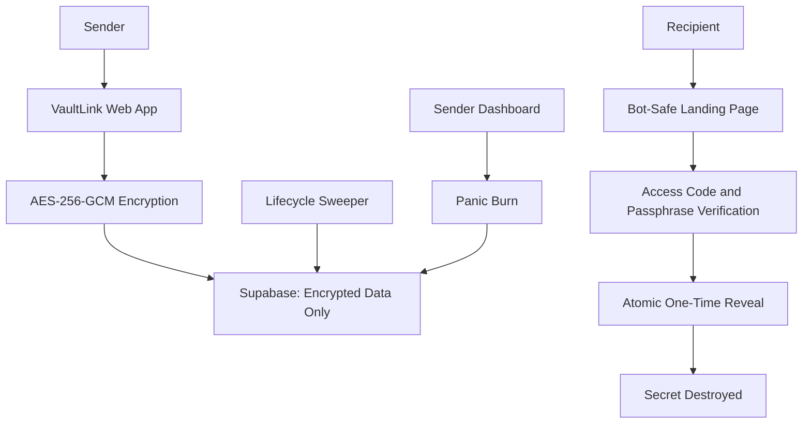

# VaultLink: Secure Handover Room - Engineering Security & Architecture Report

> **Project:** VaultLink - Zero-Knowledge One-Time Secret Handover Platform  
> **Status:** Production Hardened & Verified (Steps 1–13 Complete)  
> **Author:** Core Engineering Team  
> **Date:** September 2026  

---

## 1. Architecture Overview

VaultLink is a zero-knowledge, defense-in-depth secure handover system designed for sharing sensitive credentials—API keys, database connection strings, passwords, and private certificates—without leaving unencrypted traces in databases, logs, or intermediate transport hops.



### Core Architecture Principles
1. **Server-Side Zero-Knowledge Storage:** Plaintext secrets, access codes, passphrases, and raw tokens never touch persistent storage or disk. Supabase Postgres stores only authenticated ciphertexts, random IVs, authentication tags, salted hashes, and non-sensitive lifecycle metadata.
2. **Atomic In-Database Transactions:** State transitions, quota decrements, and cryptographic material deletion are executed inside atomic PostgreSQL stored procedures (`FOR UPDATE` row locks).
3. **Defense-in-Depth Middleware:** Hardened HTTP security headers (`Helmet`, CSP, sensitive route anti-caching), strict rate limiting (`express-rate-limit`), malformed JSON handling, and sanitized logging.
4. **Scraper & Bot Shielding:** Link-preview crawlers (Slack, Discord, WhatsApp, Twitter, etc.) are intercepted at the routing boundary and served dummy previews without triggering secret queries or consuming one-time access quotas.
5. **Decoupled Ephemeral Sessions:** Senders and recipients interact using cryptographically hashed, single-use, time-bound tokens rather than long-lived credentials.

---

## 2. Supabase Schema

The persistence layer is implemented in PostgreSQL via Supabase with Row Level Security (RLS) enabled on all tables.

### 2.1 Table: `secrets`
Stores encrypted payload material and lifecycle metadata.
- `id` (`text`, Primary Key): URL-safe cryptographically unique identifier (Nanoid).
- `ciphertext` (`text`, Nullable): Base64-encoded AES-256-GCM encrypted payload. Shredded to `NULL` upon reveal, expiry, or panic burn.
- `iv` (`text`, Nullable): Base64-encoded 12-byte initialization vector. Shredded to `NULL` upon consumption.
- `auth_tag` (`text`, Nullable): Base64-encoded 16-byte GCM authentication tag. Shredded to `NULL` upon consumption.
- `passphrase_hash` (`text`, Nullable): Salted bcrypt hash of recipient passphrase. Shredded to `NULL` upon consumption.
- `access_code_hash` (`text`, Nullable): Salted bcrypt hash of 6-digit verification code. Shredded to `NULL` upon consumption.
- `management_token_hash` (`text`, Not Null): Salted bcrypt hash of sender management token.
- `secret_fingerprint` (`text`, Not Null): First 12 characters of SHA-256(ciphertext) for safe sender verification.
- `max_views` (`integer`, Not Null, Default 1): Total allowed reveal transactions.
- `views_remaining` (`integer`, Not Null): Remaining reveal quota.
- `status` (`text`, Not Null): Lifecycle state (`scheduled`, `active`, `revealed`, `burned`, `expired`, `revoked`).
- `created_at` (`timestamptz`, Not Null, Default `now()`).
- `available_at` (`timestamptz`, Nullable): Scheduled unlock time.
- `expires_at` (`timestamptz`, Not Null): Hard expiration timestamp.
- `revealed_at` (`timestamptz`, Nullable): First successful reveal timestamp.
- `revoked_at` (`timestamptz`, Nullable): Sender panic-burn timestamp.
- `acknowledged_at` (`timestamptz`, Nullable): Recipient receipt confirmation timestamp.

### 2.2 Table: `verification_tokens`
Manages short-lived (120-second) single-use verification tokens for the recipient reveal pipeline.
- `id` (`bigint`, Identity Primary Key).
- `secret_id` (`text`, Foreign Key `secrets(id)` ON DELETE CASCADE).
- `token_hash` (`text`, Unique, Not Null): SHA-256 hash of the 32-byte raw verification token.
- `expires_at` (`timestamptz`, Not Null): Expiration deadline (120s after issue).
- `used_at` (`timestamptz`, Nullable): Timestamp when consumed during reveal.
- `created_at` (`timestamptz`, Not Null, Default `now()`).

### 2.3 Table: `acknowledgement_tokens`
Manages 15-minute single-use tokens issued only upon successful secret reveal to permit anonymous receipt acknowledgement.
- `id` (`bigint`, Identity Primary Key).
- `secret_id` (`text`, Foreign Key `secrets(id)` ON DELETE CASCADE).
- `token_hash` (`text`, Unique, Not Null): SHA-256 hash of raw acknowledgement token.
- `expires_at` (`timestamptz`, Not Null): Expiration deadline (15 minutes after reveal).
- `used_at` (`timestamptz`, Nullable): Timestamp when consumed.
- `created_at` (`timestamptz`, Not Null, Default `now()`).

### 2.4 Table: `secret_events`
Immutable audit log recording safe lifecycle telemetry.
- `id` (`bigint`, Identity Primary Key).
- `secret_id` (`text`, Foreign Key `secrets(id)` ON DELETE CASCADE).
- `event_type` (`text`, Not Null): `created`, `activated`, `verification_passed`, `verification_failed`, `revealed`, `expired`, `panic_burned`, `acknowledged`.
- `metadata` (`jsonb`, Default `{}`): Non-sensitive contextual metadata.
- `created_at` (`timestamptz`, Not Null, Default `now()`).

### 2.5 Row Level Security (RLS)
RLS is enabled on all tables with `RESTRICTIVE` policies denying public client-side access. Only the server-side backend executing via the Supabase Service Role key can perform queries and invoke security definer functions.

---

## 3. Encryption Strategy (AES-256-GCM)

VaultLink uses **AES-256-GCM** (Advanced Encryption Standard in Galois/Counter Mode), an authenticated symmetric cipher providing confidentiality and cryptographic integrity.

### Cryptographic Configuration
- **Algorithm:** `aes-256-gcm`
- **Key Size:** 256 bits (32 bytes)
- **Initialization Vector (IV):** 96 bits (12 bytes) cryptographically secure random bytes via `crypto.randomBytes(12)`
- **Authentication Tag:** 128 bits (16 bytes) generated by `cipher.getAuthTag()`

### Why Authenticated Encryption Matters
Standard block cipher modes (such as CBC, CTR, or ECB) only provide confidentiality. If an attacker or compromised database administrator modifies bits in the ciphertext, CBC mode decrypts into corrupted plaintext without error, creating opportunities for padding oracle attacks or bit-flipping exploits.

AES-256-GCM computes an authentication tag over the ciphertext. If any bit of the ciphertext, IV, or authentication tag is modified, decryption immediately halts and throws an unrecoverable exception:
```javascript
const decipher = crypto.createDecipheriv('aes-256-gcm', key, iv);
decipher.setAuthTag(authTag);
let decrypted = decipher.update(ciphertext, 'utf8');
decrypted += decipher.final('utf8'); // Throws if tampered
```
VaultLink catches this error and returns a generic failure response (`HTTP 404`) without leaking cryptographic details.

---

## 4. Key and IV Handling

1. **Master Encryption Key (`VAULT_MASTER_KEY`):**
   - Stored strictly in server environment variables.
   - Never committed to version control, never exposed to client browsers, and never stored in Supabase.
   - Validated at server bootstrap to ensure exactly 32 bytes (decoded from Base64 or UTF-8).
2. **Initialization Vector (IV) Freshness:**
   - A unique 12-byte random IV is generated for every single secret using CSPRNG (`crypto.randomBytes(12)`).
   - In GCM mode, reusing an IV with the same key breaks the authenticity guarantee and allows recovery of the plaintext. VaultLink guarantees unique IVs per row.
3. **Post-Reveal Cryptographic Shredding:**
   - As soon as the reveal transaction is confirmed or the TTL expires, the database executes an atomic `UPDATE secrets SET ciphertext = NULL, iv = NULL, auth_tag = NULL...`.
   - Even if the master key were subsequently compromised, historical secrets cannot be recovered because the ciphertext and IV no longer exist.

---

## 5. Why Base64 is Not Encryption

A common anti-pattern in amateur web applications is encoding data with Base64 and treating it as "secured."

- **Encoding vs. Encryption:** Base64 is an encoding algorithm, not encryption. It exists to represent binary data in an ASCII string format suitable for text-based protocols (MIME, JSON, URLs).
- **Zero Confidentiality:** Base64 uses an open, fixed mathematical mapping with no key, no secret, and no authentication. Anyone with access to a Base64 string can decode it instantly (`Buffer.from(str, 'base64').toString('utf8')`).
- **VaultLink Usage:** In VaultLink, Base64 is used **strictly as a serialization format** to transport binary ciphertexts, random IVs, and GCM authentication tags across JSON APIs and database columns. The actual confidentiality is enforced entirely by AES-256-GCM.

---

## 6. Scraper Defense

Modern messaging and social applications (Slack, Discord, Microsoft Teams, WhatsApp, Telegram, Apple iMessage, LinkedIn, Twitter/X) utilize automated link-preview crawlers. When a sender pastes a URL into a chat room, the chat server immediately fetches the URL via HTTP `GET` to generate open graph previews.

### The Vulnerability
If an application decrypts, consumes, decrements, or destroys a one-time secret on `GET /view/:id`, the link preview bot will burn the secret before the intended human recipient ever clicks the link.

### VaultLink Multi-Layer Defense
1. **Case-Insensitive User-Agent Inspection:**
   The `isBotOrCrawler(userAgent)` service matches incoming requests against crawler signatures (`slackbot`, `discordbot`, `whatsapp`, `twitterbot`, `facebookexternalhit`, `linkedinbot`, `telegrambot`, `crawl`, `spider`, `bot`).
2. **Zero Database Querying for Scrapers:**
   When a scraper is detected on `GET /view/:id`, VaultLink immediately returns a static, generic HTML notice:
   ```html
   <h1>VaultLink Secure Handover</h1>
   <p>This is a protected handover room. Open this link in an interactive web browser to complete verification.</p>
   ```
   No database lookups, view counter changes, or audit logs occur.
3. **Architectural Read-Only Guarantee on `GET`:**
   Even for human browsers, `GET /view/:id` is strictly an informational rendering route. It provides the recipient verification form (access code and passphrase inputs). It never consumes views, decrypts ciphertext, or destroys secrets. Decryption requires an explicit, authenticated `POST` transaction.

---

## 7. Atomic Concurrency Design

### The Race Condition Challenge
Consider a secret configured with `max_views = 1`. If an attacker or network retry storm dispatches 20 simultaneous HTTP reveal requests at the exact same millisecond:
- An unsafe application using `SELECT secret -> check views -> UPDATE views -> decrypt` will experience race conditions where multiple requests read `views_remaining = 1` before any update commits. All 20 requests would receive the decrypted secret.

### VaultLink Solution: PostgreSQL Atomic Serialization
VaultLink delegates concurrency control to PostgreSQL stored procedures using `FOR UPDATE` pessimistic row locking:

```sql
create or replace function reveal_secret_atomically(
  p_secret_id text,
  p_token_hash text,
  p_now timestamptz default now()
) returns table (
  id text,
  ciphertext text,
  iv text,
  auth_tag text,
  views_remaining integer,
  burned boolean
) language plpgsql security definer as $$
declare
  v_token record;
  v_secret record;
  v_new_views integer;
  v_should_burn boolean;
begin
  -- 1. Lock and consume single-use verification token
  select * into v_token from verification_tokens
  where token_hash = p_token_hash and secret_id = p_secret_id
  for update;

  if not found or v_token.used_at is not null or v_token.expires_at <= p_now then
    return;
  end if;

  update verification_tokens set used_at = p_now where token_hash = p_token_hash;

  -- 2. Lock secret record
  select * into v_secret from secrets
  where secrets.id = p_secret_id and secrets.status = 'active'
    and (secrets.available_at is null or secrets.available_at <= p_now)
    and secrets.expires_at > p_now and secrets.views_remaining > 0
  for update;

  if not found then return; end if;

  v_new_views := v_secret.views_remaining - 1;
  v_should_burn := (v_new_views <= 0);

  -- 3. Atomically decrement quota and shred ciphertext if burned
  update secrets set
    views_remaining = v_new_views,
    status = case when v_should_burn then 'burned' else status end,
    ciphertext = case when v_should_burn then null else ciphertext end,
    iv = case when v_should_burn then null else iv end,
    auth_tag = case when v_should_burn then null else auth_tag end,
    passphrase_hash = case when v_should_burn then null else passphrase_hash end,
    access_code_hash = case when v_should_burn then null else access_code_hash end,
    revealed_at = coalesce(revealed_at, p_now)
  where secrets.id = p_secret_id;

  return query select v_secret.id, v_secret.ciphertext, v_secret.iv, v_secret.auth_tag, v_new_views, v_should_burn;
end;
$$;
```

### Concurrency Guarantee
When 20 parallel reveal requests strike the server:
- Exactly **1** transaction acquires the lock, validates the single-use token, decrements `views_remaining` to 0, shreds the database row, and returns the ciphertext for decryption (`HTTP 200`).
- Exactly **19** transactions find the token already consumed (`used_at IS NOT NULL`) or `views_remaining <= 0`, aborting immediately with `HTTP 404`.

---

## 8. Scheduled Delivery and Cleanup

VaultLink supports deferred delivery (`available_at`) and automated expiration cleanup without requiring manual intervention:

1. **Deferred State (`scheduled`):**
   - If a secret is created with a future `available_at` timestamp, its status is set to `scheduled`.
   - Access attempts prior to `available_at` are blocked at both the HTTP handler and database RPC layers.
2. **Background Lifecycle Sweeper Daemon:**
   - An asynchronous daemon runs continuously every 15 seconds (`lifecycleSweeperService.js`).
   - Executes the Postgres stored procedure `maintain_secret_lifecycle(NOW())`.
   - **Activation:** Atomically transitions secrets where `status = 'scheduled' AND available_at <= NOW()` to `status = 'active'`.
   - **Expiry Shredding:** Atomically identifies secrets where `status IN ('active', 'scheduled') AND expires_at <= NOW()`, marks them `expired`, records an `expired` audit event, and purges all cryptographic material (`ciphertext = NULL`, `iv = NULL`, `auth_tag = NULL`, `passphrase_hash = NULL`, `access_code_hash = NULL`).
3. **Database Clock Authority:**
   - All temporal decisions rely strictly on Postgres UTC server time (`NOW()`), immune to client-side clock tampering or browser timezone skews.

---

## 9. Access Code and Passphrase Security

VaultLink enforces dual-factor verification before any reveal token is issued.

1. **Credentials:**
   - **6-Digit Access Code:** Numeric PIN (`^\d{6}$`) shared via an out-of-band communication channel (e.g., SMS, phone call).
   - **Passphrase:** High-entropy string (8 to 128 characters) shared via a separate channel.
2. **Salted Bcrypt Hashing:**
   - Credentials are never stored in plaintext. They are salted and hashed using `bcrypt` with configurable rounds (`BCRYPT_SALT_ROUNDS = 10`).
   - Constant-time verification prevents timing attacks.
3. **Anti-Enumeration Uniform Responses:**
   - If a verification attempt fails (whether the secret is expired, scheduled, burned, non-existent, or the credentials are wrong), the server returns the identical generic response:
     ```json
     { "error": "Secure handover unavailable or verification failed." }
     ```
   - Prevents attackers from probing whether a secret ID exists.
4. **Brute-Force Rate Limiting:**
   - Monitored by `verificationRateLimitService.js`: maximum 5 failed attempts per IP address and secret ID within a 10-minute sliding window. The 6th attempt triggers an immediate `HTTP 429 Too Many Requests`.

---

## 10. Panic Burn

If a sender discovers they sent a handover link to the wrong recipient, or if a credential has been rotated, they can execute an emergency **Panic Burn** from the Sender Management Dashboard.

1. **Ephemeral Management Sessions:**
   - Senders receive a private URL: `/manage/:id?token=raw-mgmt-token`.
   - The token is verified against `management_token_hash`. Upon success, the server sets a cryptographically signed HMAC-SHA256 session cookie (`HttpOnly`, `SameSite=Strict`, 15-minute TTL) and performs an immediate HTTP 302 redirect to clean `/manage/:id`.
   - The raw management token is stripped from browser history, address bars, and referrer headers.
2. **Anti-CSRF Protection:**
   - Panic Burn mutations require an anti-CSRF token bound to the session cookie and sent via the `X-CSRF-Token` header.
3. **Atomic Revocation:**
   - Calls `panic_burn_secret_atomically(secret_id, NOW())`.
   - Nullifies `ciphertext`, `iv`, `auth_tag`, `passphrase_hash`, and `access_code_hash`.
   - Transitions `status` to `revoked`, records a `panic_burned` audit event, and immediately renders recipient links unavailable.

---

## 11. Recipient Acknowledgement

To close the loop without compromising recipient anonymity, VaultLink implements zero-knowledge receipt acknowledgement:

1. **Ephemeral Acknowledgement Token:**
   - Generated during a successful secret reveal: a cryptographically random 32-byte string.
   - Only its SHA-256 hash is saved to `acknowledgement_tokens` with a 15-minute expiration.
   - The token is returned in the reveal response and held in recipient browser memory (JavaScript closure). It is never written to `localStorage`, `sessionStorage`, or cookies.
2. **Receipt Confirmation:**
   - Recipient confirms: *"I have copied and understood this secure handover."*
   - Sends `POST /api/secrets/:id/acknowledge` with the single-use token.
   - Stored procedure `acknowledge_secret_atomically` marks the token used, records `secrets.acknowledged_at = NOW()`, and appends an audit event.
3. **Zero Recipient Metadata:**
   - No recipient names, email addresses, IP addresses, user agents, or browser fingerprints are recorded.
   - The sender dashboard updates in real time to display *"Acknowledged at [timestamp]"*.

---

## 12. Presentation Demo Mode

VaultLink includes a fully functional, self-contained local Demo Mode designed for project walkthroughs, live demonstrations, and evaluators.

### Security Guarantees
- **Disabled by Default:** Requires `DEMO_MODE_ENABLED=true` in `.env`.
- **Production Air-Gap:** Strict check refuses to activate if `NODE_ENV=production`, returning `HTTP 404` even if the variable is accidentally enabled.
- **Genuine Cryptography:** Runs against the real AES-256-GCM encryption engine, genuine bcrypt hashing, and real Supabase database transactions—no mocked shortcuts.
- **Isolated Synthetic Data:** Strictly uses fake payloads (`DEMO_API_KEY_NOT_REAL`), access code `123456`, passphrase `demo-vault`, and tagged demo audit logs.
- **Interactive Concurrency Proof:** Provides a one-click dashboard widget executing 20 simultaneous reveal requests in parallel against a fresh 1-view demo secret, confirming 1 success and 19 blocked requests.

---

## 13. Test Results

VaultLink was subjected to an exhaustive automated verification suite covering all cryptographic primitives, database procedures, rate limiters, session managers, and security invariants.

### Execution Summary
- **Test Runner:** Node.js built-in test runner (`node --test`)
- **Total Test Suites:** 13
- **Total Tests Executed:** 147
- **Total Passed:** 147
- **Failures:** 0
- **Duration:** ~18.0 seconds

### Core Invariant Verification Results Table

| Test | Expected Result | Actual Result |
| :--- | :--- | :--- |
| **One-view reveal** | One successful reveal; subsequent attempts return HTTP 404 | **Pass** |
| **20 parallel requests** | Exactly 1 success (HTTP 200), exactly 19 blocked (HTTP 404) | **Pass** |
| **Bot preview** | Scrapers receive generic HTML notice; secret remains protected and unconsumed | **Pass** |
| **TTL expiry** | Background sweeper nullifies ciphertext, IV, and auth tag upon expiration | **Pass** |
| **Panic Burn** | Immediate revocation; recipient access blocked; cryptographic material shredded | **Pass** |
| **Tampered ciphertext** | AES-GCM auth tag verification fails; generic error returned without data leak | **Pass** |
| **Unique IV per secret** | Every secret generates a fresh, unique 12-byte cryptographic IV | **Pass** |
| **Zero-knowledge persistence**| Supabase contains no plaintext secret, access code, passphrase, or raw token | **Pass** |
| **Verification rate limit** | 5 failed attempts allowed; 6th attempt returns HTTP 429; cleared on success | **Pass** |
| **Sensitive route headers** | `Cache-Control: no-store`, `Pragma: no-cache`, `X-Robots-Tag`, `X-Frame-Options: DENY` enforced | **Pass** |
| **Session hijacking defense**| Management sessions cannot manage other secret IDs; invalid tokens return 404 | **Pass** |
| **Anti-CSRF defense** | Panic Burn rejects missing or invalid CSRF tokens | **Pass** |
| **Error information leakage**| Malformed JSON and uncaught server errors return generic messages with no stack traces | **Pass** |

---

## 14. Limitations and Future Work

### Current Limitations
1. **Client Trust Model:** While Supabase storage is completely zero-knowledge, the Express application server currently executes the AES-256-GCM encryption and decryption. Users must trust the host environment executing the Node.js process.
2. **Payload Size Limit:** Secret payloads are currently capped at 10,000 characters (optimized for credentials, tokens, and keys rather than large binary files).
3. **Database Dependency:** The atomic race-condition defense depends on PostgreSQL stored procedures and row-level locking. Migrating to non-relational or distributed eventual-consistency databases would require alternative distributed locking primitives (e.g., Redis Redlock).

### Future Improvements
1. **End-to-End Client-Side WebCrypto (Zero-Knowledge Server):**
   - Implement WebCrypto API in the browser to derive keys using PBKDF2/Argon2 from the recipient passphrase directly on the client.
   - Encrypt in the sender's browser and decrypt in the recipient's browser so that even the Express backend server never sees plaintext payloads.
2. **Hardware Security Module (HSM) / KMS Integration:**
   - Integrate AWS KMS, Google Cloud KMS, or HashiCorp Vault to wrap and manage the master key with automatic rotation and hardware-backed key protection.
3. **Encrypted File Attachments:**
   - Support encrypted chunked streaming for secure transfer of configuration files, private keys (`.pem`), and credentials packages up to 25 MB.
4. **FIDO2 / WebAuthn Hardware Key Authentication:**
   - Allow senders to bind handovers to physical security keys (YubiKey) via WebAuthn for high-assurance enterprise handovers.
